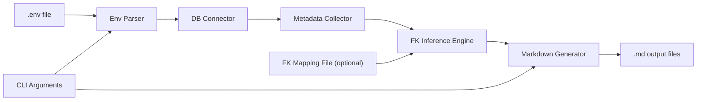
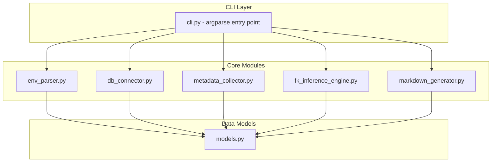
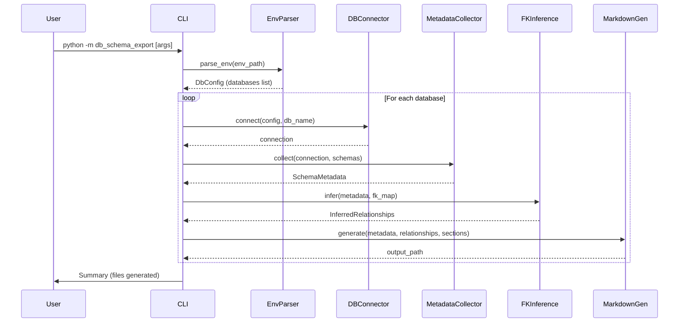
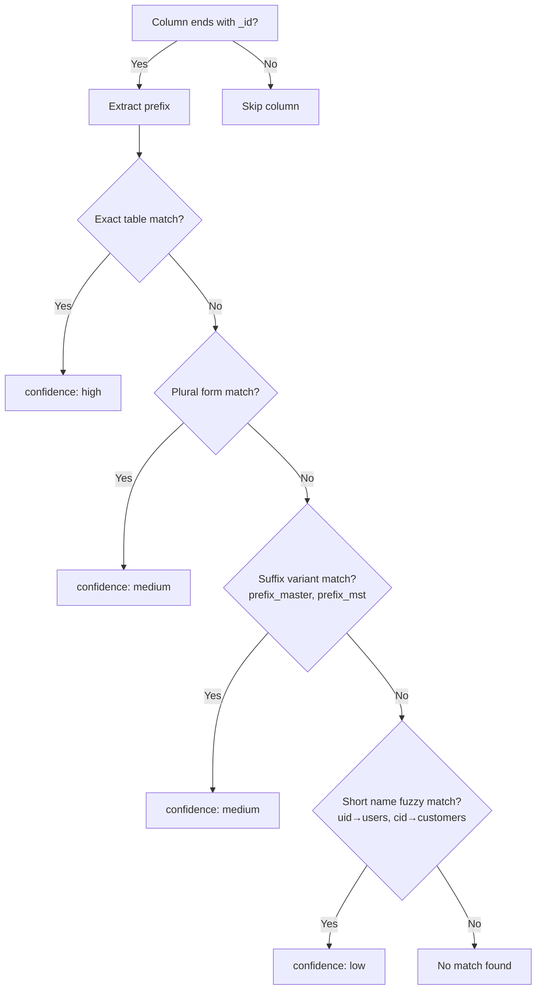
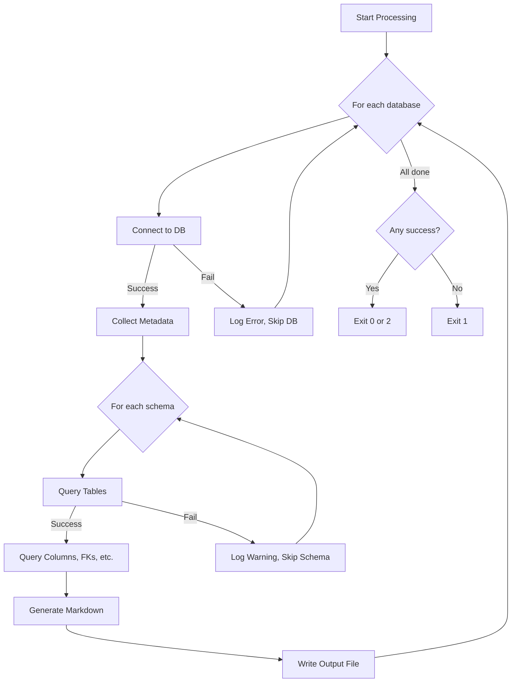

# Design Document: Database Schema Export Tool

## Table of Contents

- [Overview](#overview)
- [Architecture](#architecture)
- [Components and Interfaces](#components-and-interfaces)
- [Data Models](#data-models)
- [Correctness Properties](#correctness-properties)
- [Error Handling](#error-handling)
- [Testing Strategy](#testing-strategy)

## Overview

Công cụ Python độc lập để xuất schema database PostgreSQL thành file Markdown (.md) toàn diện. Công cụ đọc cấu hình từ file `.env` của dự án Laravel, truy vấn trực tiếp metadata database qua `information_schema` và `pg_catalog`, sau đó sinh file Markdown chứa ERD diagram (Mermaid), chi tiết tables, views, functions, và triggers.

### Quyết định thiết kế chính

| Quyết định | Lý do |
|---|---|
| Python standalone (không phải Laravel command) | Tách biệt khỏi framework, dễ chạy trong CI/CD, không phụ thuộc PHP |
| psycopg2 cho PostgreSQL | Thư viện PostgreSQL phổ biến nhất, hỗ trợ đầy đủ metadata queries |
| argparse cho CLI | Có sẵn trong Python stdlib, đủ mạnh cho use case này |
| FK Inference Engine riêng biệt | Nhiều database không có FK constraints tường minh, cần dự đoán relationships |
| Mermaid erDiagram | Render trực tiếp trong GitHub, GitLab, và nhiều Markdown viewers |
| Một file .md per database | Dễ quản lý, mỗi file tự chứa đầy đủ thông tin |

### Data Flow tổng quan



## Architecture

### Kiến trúc module

Công cụ được tổ chức theo kiến trúc pipeline, mỗi module có trách nhiệm rõ ràng:



### File Structure

```
db_schema_export/
├── __init__.py
├── __main__.py              # Entry point: python -m db_schema_export
├── cli.py                   # CLI argument parsing và orchestration
├── env_parser.py            # Đọc và parse file .env
├── db_connector.py          # Database connection management
├── metadata_collector.py    # Truy vấn metadata từ database
├── fk_inference_engine.py   # Dự đoán FK relationships
├── markdown_generator.py    # Sinh file Markdown output
├── models.py                # Data classes cho metadata
├── exceptions.py            # Custom exceptions
└── tests/
    ├── __init__.py
    ├── test_env_parser.py
    ├── test_fk_inference_engine.py
    ├── test_markdown_generator.py
    ├── test_metadata_collector.py
    └── conftest.py
```

### Execution Flow



## Components and Interfaces

### 1. `cli.py` - CLI Entry Point

```python
def parse_args(argv: list[str] | None = None) -> argparse.Namespace:
    """Parse command-line arguments.
    
    Arguments:
        --output: Output directory (default: ".")
        --env: Path to .env file (default: ".env")
        --schema: Comma-separated schema list (default: all non-system)
        --sections: Comma-separated sections (default: all)
        --no-infer-fk: Disable FK inference
        --fk-map: Path to FK mapping file (JSON)
    """
    ...

def main(argv: list[str] | None = None) -> int:
    """Main orchestration function. Returns exit code (0=success, 1=error)."""
    ...
```

### Sample `.env` Configuration

Công cụ chỉ sử dụng các biến `DB_*` từ file `.env`. Dưới đây là sample:

```dotenv
# Database connection type: "pgsql" hoặc "mysql"
DB_CONNECTION=pgsql

# Connection parameters (dùng chung cho tất cả databases)
DB_HOST=127.0.0.1
DB_PORT=5432
DB_USERNAME=sabitech
DB_PASSWORD="Sbt@12345"

# Single database (backward compatible)
DB_DATABASE="feelcycle-mob-db-dev"

# Multiple databases (optional - nếu có thì DB_DATABASE bị bỏ qua)
# DB_DATABASES="feelcycle-mob-db-dev,feelcycle-stg,feelcycle-prod"
```

**Lưu ý:**
- Nếu `DB_DATABASES` được define → tool xử lý tất cả databases trong list
- Nếu `DB_DATABASES` không có → fallback sang `DB_DATABASE`
- Giá trị có thể có hoặc không có dấu ngoặc kép (`"`)
- `DB_SSLMODE` và các biến khác không liên quan sẽ bị bỏ qua

### 2. `env_parser.py` - Environment Parser

```python
@dataclass
class DbConfig:
    connection: str        # "pgsql" | "mysql"
    host: str
    port: int
    username: str
    password: str
    databases: list[str]   # List of database names to process

def parse_env(env_path: str) -> DbConfig:
    """Parse .env file and return database configuration.
    
    Raises:
        EnvFileNotFoundError: if .env file doesn't exist
        MissingVariableError: if required variables are missing
        NoDatabaseError: if neither DB_DATABASES nor DB_DATABASE is defined
    """
    ...
```

### 3. `db_connector.py` - Database Connector

```python
from abc import ABC, abstractmethod

class DatabaseConnector(ABC):
    """Abstract interface for database connections."""
    
    @abstractmethod
    def connect(self) -> None: ...
    
    @abstractmethod
    def close(self) -> None: ...
    
    @abstractmethod
    def execute_query(self, query: str, params: tuple = ()) -> list[dict]: ...
    
    def __enter__(self): ...
    def __exit__(self, *args): ...

class PostgresConnector(DatabaseConnector):
    """PostgreSQL implementation using psycopg2."""
    
    def __init__(self, host: str, port: int, database: str, 
                 username: str, password: str): ...

class MySQLConnector(DatabaseConnector):
    """MySQL implementation using mysql-connector-python (future)."""
    ...

def create_connector(config: DbConfig, database: str) -> DatabaseConnector:
    """Factory function to create appropriate connector based on DB_CONNECTION."""
    ...
```

### 4. `metadata_collector.py` - Metadata Collector

```python
class MetadataCollector:
    """Collects schema metadata from database using information_schema queries."""
    
    def __init__(self, connector: DatabaseConnector): ...
    
    def get_schemas(self) -> list[str]:
        """Get all non-system schemas (excluding pg_catalog, information_schema, pg_toast)."""
        ...
    
    def get_tables(self, schemas: list[str]) -> list[TableMetadata]:
        """Get all tables in specified schemas with comments."""
        ...
    
    def get_columns(self, schema: str, table: str) -> list[ColumnMetadata]:
        """Get column details for a specific table."""
        ...
    
    def get_primary_keys(self, schemas: list[str]) -> dict[str, list[str]]:
        """Get primary key columns grouped by schema.table."""
        ...
    
    def get_foreign_keys(self, schemas: list[str]) -> list[ForeignKeyMetadata]:
        """Get explicit FK constraints."""
        ...
    
    def get_views(self, schemas: list[str]) -> list[ViewMetadata]:
        """Get view definitions."""
        ...
    
    def get_functions(self, schemas: list[str]) -> list[FunctionMetadata]:
        """Get function/procedure metadata."""
        ...
    
    def get_triggers(self, schemas: list[str]) -> list[TriggerMetadata]:
        """Get trigger metadata."""
        ...
    
    def collect_all(self, schemas: list[str]) -> SchemaMetadata:
        """Collect all metadata for specified schemas. Main entry point."""
        ...
```

#### Key SQL Queries (PostgreSQL)

**Tables:**
```sql
SELECT t.table_schema, t.table_name, 
       pg_catalog.obj_description(c.oid) as table_comment
FROM information_schema.tables t
LEFT JOIN pg_catalog.pg_class c ON c.relname = t.table_name
LEFT JOIN pg_catalog.pg_namespace n ON n.oid = c.relnamespace 
    AND n.nspname = t.table_schema
WHERE t.table_schema = ANY(%s)
  AND t.table_type = 'BASE TABLE'
ORDER BY t.table_schema, t.table_name;
```

**Columns with comments:**
```sql
SELECT c.column_name, c.data_type, c.is_nullable, 
       c.column_default, c.character_maximum_length,
       c.numeric_precision, c.numeric_scale,
       pg_catalog.col_description(
           (SELECT oid FROM pg_catalog.pg_class WHERE relname = c.table_name 
            AND relnamespace = (SELECT oid FROM pg_catalog.pg_namespace 
                                WHERE nspname = c.table_schema)),
           c.ordinal_position
       ) as column_comment
FROM information_schema.columns c
WHERE c.table_schema = %s AND c.table_name = %s
ORDER BY c.ordinal_position;
```

**Foreign Keys:**
```sql
SELECT 
    tc.table_schema, tc.table_name, kcu.column_name,
    ccu.table_schema AS referenced_schema,
    ccu.table_name AS referenced_table,
    ccu.column_name AS referenced_column
FROM information_schema.table_constraints tc
JOIN information_schema.key_column_usage kcu 
    ON tc.constraint_name = kcu.constraint_name
    AND tc.table_schema = kcu.table_schema
JOIN information_schema.constraint_column_usage ccu 
    ON ccu.constraint_name = tc.constraint_name
WHERE tc.constraint_type = 'FOREIGN KEY'
  AND tc.table_schema = ANY(%s);
```

**Views:**
```sql
SELECT table_schema, table_name, view_definition
FROM information_schema.views
WHERE table_schema = ANY(%s)
ORDER BY table_schema, table_name;
```

**Functions:**
```sql
SELECT n.nspname as schema, p.proname as name,
       pg_catalog.pg_get_function_arguments(p.oid) as arguments,
       pg_catalog.pg_get_function_result(p.oid) as return_type,
       l.lanname as language,
       CASE p.prokind 
           WHEN 'f' THEN 'function'
           WHEN 'p' THEN 'procedure'
           WHEN 'w' THEN 'window'
       END as type
FROM pg_catalog.pg_proc p
JOIN pg_catalog.pg_namespace n ON n.oid = p.pronamespace
JOIN pg_catalog.pg_language l ON l.oid = p.prolang
WHERE n.nspname = ANY(%s)
  AND p.proname NOT LIKE 'pg_%'
ORDER BY n.nspname, p.proname;
```

**Triggers:**
```sql
SELECT trigger_schema, trigger_name, event_object_table,
       action_timing, event_manipulation, action_statement
FROM information_schema.triggers
WHERE trigger_schema = ANY(%s)
ORDER BY event_object_table, trigger_name;
```

### 5. `fk_inference_engine.py` - FK Inference Engine

```python
@dataclass
class InferredFK:
    source_schema: str
    source_table: str
    source_column: str
    target_schema: str
    target_table: str
    target_column: str
    confidence: str  # "high" | "medium" | "low"
    reason: str      # Explanation of why this was inferred

class FKInferenceEngine:
    """Infers FK relationships based on column naming conventions."""
    
    def __init__(self, tables: list[TableMetadata], 
                 fk_mapping: dict[str, str] | None = None): ...
    
    def infer_all(self) -> list[InferredFK]:
        """Run inference on all tables and return inferred relationships."""
        ...
    
    def _match_column_to_table(self, column_name: str, 
                                schema: str) -> InferredFK | None:
        """Attempt to match a column name to a referenced table.
        
        Matching rules (in priority order):
        1. Exact match: {table_name}_id -> table_name.id (confidence: high)
        2. Plural match: {singular}_id -> {plural_table}.id (confidence: medium)
        3. Suffix match: {name}_id -> {name}_master.id, {name}s.id (confidence: medium)
        4. Short name match: uid -> users.id, cid -> customers.id (confidence: low)
        """
        ...
    
    def _apply_mapping_overrides(self, inferred: list[InferredFK]) -> list[InferredFK]:
        """Apply FK mapping file overrides to inferred relationships."""
        ...
```

#### FK Inference Algorithm



**Chi tiết thuật toán matching:**

1. **Exact match** (`confidence: high`):
   - Column `user_id` → tìm table `user` trong cùng schema
   - Column `order_item_id` → tìm table `order_item`

2. **Plural match** (`confidence: medium`):
   - Column `user_id` → tìm table `users` (thêm 's')
   - Column `category_id` → tìm table `categories` (thay 'y' → 'ies')
   - Column `status_id` → tìm table `statuses` (thêm 'es')

3. **Suffix variant match** (`confidence: medium`):
   - Column `store_id` → tìm table `store_master`, `store_mst`
   - Column `product_id` → tìm table `products`, `product_master`

4. **Short name fuzzy match** (`confidence: low`):
   - Column `uid` → tìm table `user`, `users`
   - Column `cid` → tìm table `customer`, `customers`
   - Dựa trên mapping dictionary cố định cho các abbreviations phổ biến

### 6. `markdown_generator.py` - Markdown Generator

```python
class MarkdownGenerator:
    """Generates Markdown output file from collected metadata."""
    
    def __init__(self, metadata: SchemaMetadata, 
                 relationships: list[ForeignKeyMetadata | InferredFK],
                 sections: list[str],
                 multi_schema: bool = False): ...
    
    def generate(self, output_path: str) -> str:
        """Generate complete Markdown file. Returns the output file path."""
        ...
    
    def _generate_toc(self) -> str:
        """Generate table of contents with anchor links."""
        ...
    
    def _generate_erd_section(self) -> str:
        """Generate Mermaid erDiagram section."""
        ...
    
    def _generate_tables_section(self) -> str:
        """Generate detailed tables section."""
        ...
    
    def _generate_views_section(self) -> str:
        """Generate views section with SQL definitions."""
        ...
    
    def _generate_functions_section(self) -> str:
        """Generate functions/procedures summary table."""
        ...
    
    def _generate_triggers_section(self) -> str:
        """Generate triggers section grouped by table."""
        ...
```

#### Mermaid ERD Generation Logic

Relationship notation mapping:
- `||--||` : one-to-one (unique FK, not nullable)
- `||--o|` : one-to-zero-or-one (unique FK, nullable)
- `||--o{` : one-to-zero-or-many (FK, nullable)
- `||--|{` : one-to-many (FK, not nullable)

Inferred relationships sử dụng dashed lines: `..` thay vì `--`

```
erDiagram
    users ||--o{ orders : "has"
    users ..o{ comments : "inferred"
```

## Data Models

```python
from dataclasses import dataclass, field

@dataclass
class ColumnMetadata:
    name: str
    data_type: str
    is_nullable: bool
    default_value: str | None
    is_primary_key: bool = False
    is_foreign_key: bool = False
    comment: str | None = None
    max_length: int | None = None

@dataclass
class TableMetadata:
    schema: str
    name: str
    columns: list[ColumnMetadata] = field(default_factory=list)
    comment: str | None = None

@dataclass
class ForeignKeyMetadata:
    source_schema: str
    source_table: str
    source_column: str
    target_schema: str
    target_table: str
    target_column: str
    status: str = "confirmed"  # "confirmed" | "inferred"
    confidence: str | None = None  # "high" | "medium" | "low" (only for inferred)

@dataclass
class ViewMetadata:
    schema: str
    name: str
    definition: str
    columns: list[ColumnMetadata] = field(default_factory=list)

@dataclass
class FunctionMetadata:
    schema: str
    name: str
    arguments: str
    return_type: str
    language: str
    func_type: str  # "function" | "procedure" | "trigger function"

@dataclass
class TriggerMetadata:
    schema: str
    name: str
    table_name: str
    timing: str       # "BEFORE" | "AFTER" | "INSTEAD OF"
    event: str        # "INSERT" | "UPDATE" | "DELETE" | combined
    function_name: str

@dataclass
class SchemaMetadata:
    database_name: str
    schemas: list[str]
    tables: list[TableMetadata]
    foreign_keys: list[ForeignKeyMetadata]
    views: list[ViewMetadata]
    functions: list[FunctionMetadata]
    triggers: list[TriggerMetadata]
```


## Correctness Properties

*A property is a characteristic or behavior that should hold true across all valid executions of a system-essentially, a formal statement about what the system should do. Properties serve as the bridge between human-readable specifications and machine-verifiable correctness guarantees.*

### Property 1: Env Parsing Correctness (Round-Trip)

*For any* valid `.env` file content containing database configuration variables (DB_CONNECTION, DB_HOST, DB_PORT, DB_USERNAME, DB_PASSWORD, DB_DATABASE/DB_DATABASES), parsing the file SHALL extract all required variables with their exact values preserved, and for any `.env` content missing one or more required variables, the parser SHALL raise an error listing exactly the missing variable names.

**Validates: Requirements 1.2, 1.3, 1.4, 1.8**

### Property 2: Metadata Completeness

*For any* database schema containing tables, columns, views, functions, and triggers, the MetadataCollector SHALL capture every object in the `SchemaMetadata` result — specifically, for any table in the schema the table SHALL appear in `metadata.tables`, for any column in a table the column SHALL appear in that table's `columns` list, and similarly for views, functions, and triggers. No metadata object present in the database shall be absent from the collected result.

**Validates: Requirements 9.1, 9.2, 9.3, 9.4, 9.5, 9.6, 9.7, 9.8**

### Property 3: FK Inference Correctness

*For any* set of tables and a column whose name ends with `_id`, if the prefix (before `_id`) matches an existing table name (exact match, plural form, or suffix variant), the FK Inference Engine SHALL produce an `InferredFK` pointing to that table's `id` column with appropriate confidence level. Furthermore, *for any* FK mapping file entry that conflicts with an inferred relationship, the mapping file definition SHALL take precedence and override the inferred result.

**Validates: Requirements 13.2, 13.3, 13.4, 13.6, 13.9**

### Property 4: Markdown Output Validity

*For any* valid `SchemaMetadata` input, the Markdown Generator SHALL produce output where: (a) the Mermaid `erDiagram` block contains syntactically valid Mermaid notation, (b) all section headings follow proper hierarchy (H1 > H2 > H3), (c) the table of contents links correspond to actual headings in the document, and (d) explicit FK relationships use solid lines (`--`) while inferred relationships use dashed lines (`..`).

**Validates: Requirements 3.3, 3.4, 3.5, 4.1, 4.5, 4.6**

### Property 5: Multi-Database Isolation

*For any* list of N target databases configured via `DB_DATABASES`, the tool SHALL produce exactly N independent output files, and *for any* two distinct databases in the list, the content of one database's output file SHALL NOT contain table names, view names, or any metadata belonging exclusively to the other database.

**Validates: Requirements 1.6, 3.1, 3.2, 11.2**

### Property 6: Schema Filtering Correctness

*For any* set of schemas specified via the `--schema` argument, the exported output SHALL contain only objects (tables, views, functions, triggers) belonging to those specified schemas, and SHALL NOT contain any objects from schemas not in the specified list. When `--schema` is not provided, all non-system schemas (excluding `pg_catalog`, `information_schema`, `pg_toast`) SHALL be included.

**Validates: Requirements 12.1, 12.2, 12.3, 12.4**

## Error Handling

### Error Types và Handling Strategy

| Error Type | Exception Class | Handling Strategy | Exit Code |
|---|---|---|---|
| File `.env` không tồn tại | `EnvFileNotFoundError` | Hiển thị đường dẫn đã tìm, dừng ngay | 1 |
| Thiếu biến môi trường bắt buộc | `MissingVariableError` | Liệt kê tất cả biến thiếu, dừng ngay | 1 |
| Không có database nào được chỉ định | `NoDatabaseError` | Thông báo cần DB_DATABASES hoặc DB_DATABASE, dừng ngay | 1 |
| Kết nối database thất bại | `DatabaseConnectionError` | Hiển thị host:port/db_name (KHÔNG hiển thị password), tiếp tục với database khác | 2 |
| Schema không tồn tại | `SchemaNotFoundWarning` | Cảnh báo (warning), tiếp tục với schema hợp lệ | 0 (nếu còn schema hợp lệ) |
| Tất cả schema không hợp lệ | `AllSchemasInvalidError` | Thông báo lỗi, dừng | 1 |
| FK Mapping File không tồn tại | `FKMapFileNotFoundError` | Hiển thị cảnh báo (warning), tiếp tục không dùng FK mapping | 0 |
| FK Mapping File JSON không hợp lệ | `FKMapParseError` | Hiển thị lỗi parsing với line number, dừng ngay | 1 |
| Query metadata thất bại | `MetadataQueryError` | Log lỗi, tiếp tục với các query khác | 2 |
| Không thể ghi file output | `OutputWriteError` | Hiển thị đường dẫn và lý do, dừng | 1 |

### Error Message Format

Tất cả error messages tuân theo format thống nhất:

```
[ERROR] {ErrorType}: {Mô tả ngắn gọn}
  → {Chi tiết cụ thể}
  → {Gợi ý khắc phục (nếu có)}
```

Ví dụ:

```
[ERROR] EnvFileNotFoundError: Cannot find .env file
  → Searched path: /home/user/project/.env
  → Hint: Use --env flag to specify a custom path

[ERROR] MissingVariableError: Required environment variables are missing
  → Missing: DB_HOST, DB_PASSWORD
  → Ensure these variables are defined in your .env file

[ERROR] DatabaseConnectionError: Cannot connect to database
  → Host: localhost:5432/mydb
  → Check that the database server is running and credentials are correct

[WARNING] SchemaNotFoundWarning: Schema does not exist
  → Schema "salesforce" not found in database "mydb"
  → Continuing with remaining schemas: public
```

### Exit Codes

| Exit Code | Ý nghĩa |
|---|---|
| 0 | Thành công hoàn toàn (có thể có warnings) |
| 1 | Lỗi nghiêm trọng - không thể tiếp tục (config error, file error) |
| 2 | Thành công một phần - một số database/query thất bại nhưng có output |

### Graceful Degradation

Công cụ áp dụng chiến lược "fail-forward" khi xử lý nhiều database:

1. **Multi-database processing**: Nếu một database trong danh sách không kết nối được, công cụ log lỗi và tiếp tục với các database còn lại. Chỉ khi TẤT CẢ database đều thất bại mới trả exit code 1.

2. **Multi-schema processing**: Nếu một schema không tồn tại, công cụ hiển thị warning và tiếp tục với các schema hợp lệ.

3. **Metadata collection**: Nếu một query metadata thất bại (ví dụ: không có quyền đọc triggers), công cụ log warning và tiếp tục thu thập các loại metadata khác. Section tương ứng trong output sẽ hiển thị "Could not retrieve data".

4. **FK Inference**: Nếu FK inference gặp lỗi cho một table cụ thể, công cụ bỏ qua table đó và tiếp tục inference cho các table khác.



## Testing Strategy

### Tổng quan

Công cụ sử dụng chiến lược testing kết hợp:
- **Property-based tests** (Hypothesis): Kiểm tra các thuộc tính phổ quát trên nhiều input ngẫu nhiên
- **Unit tests** (pytest): Kiểm tra các trường hợp cụ thể, edge cases, và error conditions
- **Integration tests**: Kiểm tra với database PostgreSQL thực (test container)

### Testing Framework

| Tool | Mục đích |
|---|---|
| pytest | Test runner chính |
| pytest-cov | Coverage reporting |
| Hypothesis | Property-based testing |
| pytest-mock / unittest.mock | Mocking database connections |
| testcontainers-python | PostgreSQL container cho integration tests |
| faker | Sinh dữ liệu test ngẫu nhiên |

### Unit Testing Approach

**Mocking Strategy:**
- Mock `psycopg2.connect()` để test MetadataCollector mà không cần database thực
- Mock file system để test EnvParser và MarkdownGenerator
- Sử dụng fixture factories để tạo `SchemaMetadata` objects với dữ liệu đa dạng

**Test Files:**

| File | Module được test | Focus |
|---|---|---|
| `test_env_parser.py` | `env_parser.py` | Parsing .env, error handling, edge cases |
| `test_fk_inference_engine.py` | `fk_inference_engine.py` | Matching rules, confidence levels, overrides |
| `test_markdown_generator.py` | `markdown_generator.py` | Output format, Mermaid syntax, section ordering |
| `test_metadata_collector.py` | `metadata_collector.py` | Query construction, result mapping |
| `test_cli.py` | `cli.py` | Argument parsing, orchestration logic |

### Property-Based Testing (Hypothesis)

Mỗi Correctness Property được implement bằng một property-based test với tối thiểu 100 iterations:

| Property | Test File | Strategy |
|---|---|---|
| P1: Env Parsing | `test_env_parser.py` | Generate random .env content, verify round-trip extraction |
| P2: Metadata Completeness | `test_metadata_collector.py` | Generate random schema structures, verify all objects captured |
| P3: FK Inference | `test_fk_inference_engine.py` | Generate random table/column names with _id suffix, verify matching |
| P4: Markdown Validity | `test_markdown_generator.py` | Generate random SchemaMetadata, verify output structure |
| P5: Multi-DB Isolation | `test_cli.py` | Generate random DB lists, verify independent outputs |
| P6: Schema Filtering | `test_metadata_collector.py` | Generate random schema lists, verify filtering |

**Hypothesis Strategies (Custom Generators):**

```python
from hypothesis import strategies as st

# Strategy cho valid database names
db_names = st.text(
    alphabet=st.characters(whitelist_categories=('Ll', 'Lu', 'Nd'), 
                           whitelist_characters='_'),
    min_size=1, max_size=63
)

# Strategy cho valid column names ending in _id
fk_column_names = st.builds(
    lambda prefix: f"{prefix}_id",
    st.text(alphabet='abcdefghijklmnopqrstuvwxyz_', min_size=1, max_size=30)
)

# Strategy cho SchemaMetadata
schema_metadata = st.builds(
    SchemaMetadata,
    database_name=db_names,
    schemas=st.lists(st.sampled_from(['public', 'app', 'sales']), min_size=1),
    tables=st.lists(table_metadata_strategy, min_size=1, max_size=20),
    foreign_keys=st.lists(fk_metadata_strategy),
    views=st.lists(view_metadata_strategy),
    functions=st.lists(function_metadata_strategy),
    triggers=st.lists(trigger_metadata_strategy),
)
```

**Tag Format cho mỗi property test:**

```python
# Feature: database-schema-export-tool, Property 1: Env parsing correctness
@given(env_content=valid_env_strategy())
@settings(max_examples=100)
def test_property_1_env_parsing_round_trip(env_content):
    ...
```

### Integration Testing

**Setup:** Sử dụng `testcontainers-python` để khởi tạo PostgreSQL container với schema test:

```python
@pytest.fixture(scope="session")
def postgres_container():
    with PostgresContainer("postgres:15") as pg:
        # Apply test migrations
        yield pg
```

**Integration Test Scenarios:**
1. Full pipeline: `.env` → connect → collect → infer → generate → verify `.md` output
2. Multi-database: Tạo 2-3 databases, verify independent outputs
3. Multi-schema: Tạo schemas `public` + `app`, verify schema filtering
4. Empty database: Database không có tables, verify graceful output
5. Large schema: 50+ tables với relationships, verify performance

### Test Data Strategy

1. **Fixtures**: Predefined `SchemaMetadata` objects cho unit tests (small, medium, large schemas)
2. **Factories**: Factory functions tạo random metadata objects cho property tests
3. **SQL Seeds**: SQL scripts tạo test schema trong PostgreSQL container
4. **Golden Files**: Expected markdown output cho regression testing (so sánh output với file mẫu)

### Coverage Goals

| Metric | Target |
|---|---|
| Line coverage | ≥ 90% |
| Branch coverage | ≥ 85% |
| Property tests per property | ≥ 100 iterations |
| Integration test scenarios | ≥ 10 |
| Error path coverage | 100% (tất cả exception types) |

### Test Execution

```bash
# Unit tests + property tests
pytest tests/ -v --cov=db_schema_export --cov-report=html

# Integration tests only (requires Docker)
pytest tests/ -v -m integration

# Property tests only
pytest tests/ -v -m property

# Quick smoke test
pytest tests/ -v -m "not integration" --timeout=30
```
